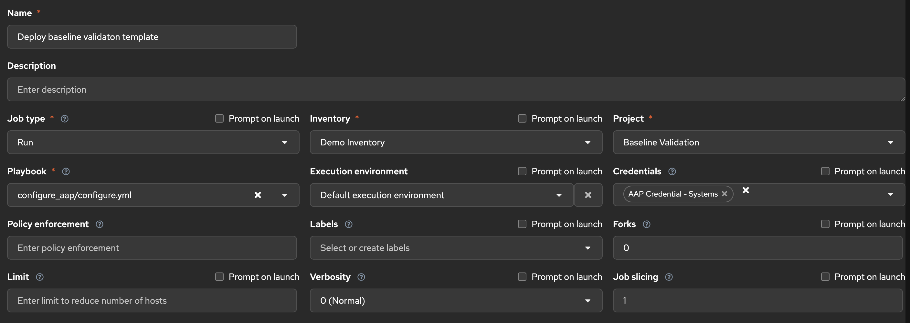

# AAP Config-as-Code

This directory contains everything needed to stand up the AAP objects for the baseline validation demo using a single playbook run.

## What it creates

| Object | Name |
|--------|------|
| Organization | Demo |
| Project | Baseline Validation |
| Inventory | Baseline Demo Inventory |
| Inventory Groups | `rhel`, `windows` (Windows group carries WinRM/CredSSP connection vars) |
| Machine Credentials | Baseline Demo Machine Credential (RHEL), Baseline Windows Machine Credential |
| Job Templates + Surveys | Validate Baseline - RHEL, Validate Baseline - Windows |

## Prerequisites

1. Install required collections:
   ```bash
   ansible-galaxy collection install -r collections/requirements.yml
   ```

2. Export AAP controller connection details (no secrets in git):
   ```bash
   export CONTROLLER_HOST=https://your-aap-controller.example.com
   export CONTROLLER_USERNAME=admin
   export CONTROLLER_PASSWORD=yourpassword
   # Or use a token instead:
   # export CONTROLLER_OAUTH_TOKEN=yourtoken
   ```

3. After `configure.yml` runs, open the AAP UI and add the actual SSH username/key to the **Baseline Demo Machine Credential**, and the CredSSP username/password to the **Baseline Windows Machine Credential** — the playbook creates the credential objects but cannot store secrets.

4. Add your target RHEL hosts to the **rhel** group and Windows hosts to the **windows** group within the **Baseline Demo Inventory** in the AAP UI (or wire up a dynamic inventory source).

## Run

```bash
ansible-playbook configure_aap/configure.yml
```

The playbook is idempotent — safe to re-run after any change to the vars files.

---

## Manual: Create the "Deploy Baseline Validation Template" job template

If you prefer to create the config-as-code job template by hand in the AAP UI rather than running `configure.yml`, follow these steps. This template runs `configure_aap/configure.yml` to provision all other AAP objects.



### Field-by-field settings

| Field | Value |
|-------|-------|
| **Name** | `Deploy baseline validation template` |
| **Job type** | `Run` |
| **Inventory** | `Demo Inventory` (or whichever inventory contains your controller's localhost) |
| **Project** | `Baseline Validation` |
| **Playbook** | `configure_aap/configure.yml` |
| **Execution environment** | `Default execution environment` |
| **Credentials** | `AAP Credential - Systems` (an AAP credential type that supplies `CONTROLLER_HOST`, `CONTROLLER_USERNAME`, and `CONTROLLER_PASSWORD` to the job environment) |
| **Verbosity** | `0 (Normal)` |
| **Forks** | `0` (default) |
| **Job slicing** | `1` (default) |

> **Tip — AAP Credential type:** The `AAP Credential - Systems` credential uses the built-in **Red Hat Ansible Automation Platform** credential type. It injects the controller URL, username, and password as environment variables automatically, so no secrets need to be stored in the playbook or vars files.

### Steps

1. In AAP, navigate to **Templates** and click **Add → Add job template**.
2. Fill in the fields from the table above.
3. Click **Save**.
4. Launch the template. It will create the inventory, machine credential, and **Validate Baseline** job template for you.
5. After the job completes, open **Credentials → Baseline Demo Machine Credential** and enter the SSH details for your target RHEL hosts.
